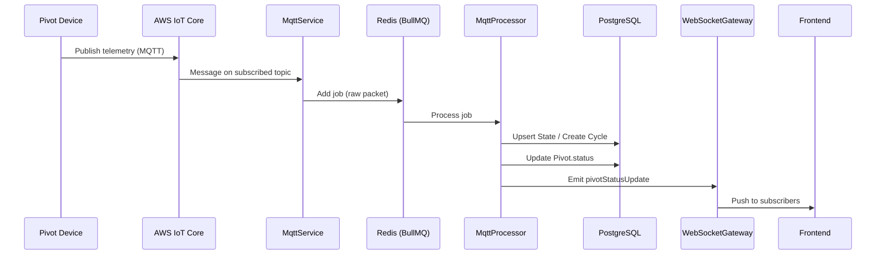

# Skill: MQTT Worker Pipeline

## When to use

When implementing or modifying the MQTT ingestion (TASK-7) and MQTT worker (TASK-8) phases.

## Data flow (end-to-end)

```
1. Pivot device → publishes telemetry to AWS IoT Core (MQTT topic)
2. MqttService → subscribes to topic, receives raw packet
3. MqttService → enqueues raw packet to BullMQ Redis queue
4. MqttProcessor → consumes job from queue
5. MqttProcessor → parses packet, determines event type (power-on, telemetry, power-off)
6. MqttProcessor → upserts State / creates Cycle / updates Pivot.status
7. MqttProcessor → emits WebSocket event via WebSocketGateway
8. Frontend → receives real-time update
```



## MQTT topic structure

```
soiltech/pivots/{pivotId}/telemetry   ← device publishes here
soiltech/pivots/{pivotId}/command     ← backend publishes commands here
```

## Event types and processing logic

| Event         | Detection                                 | Action                                             |
| ------------- | ----------------------------------------- | -------------------------------------------------- |
| **Power-on**  | `isOn` transitions from `false` to `true` | Create new `State` record                          |
| **Telemetry** | Regular update while `isOn === true`      | Create new `Cycle` record linked to active `State` |
| **Power-off** | `isOn` transitions from `true` to `false` | Update active `State` to `isOn: false`             |

## MqttService skeleton (ingestion only)

```typescript
// src/mqtt/mqtt.service.ts
import { Injectable, OnModuleInit, OnModuleDestroy } from '@nestjs/common';
import { ConfigService } from '@nestjs/config';
import { InjectQueue } from '@nestjs/bullmq';
import { Queue } from 'bullmq';
import * as mqtt from 'mqtt';

const MQTT_QUEUE_NAME = 'mqtt-telemetry';

@Injectable()
export class MqttService implements OnModuleInit, OnModuleDestroy {
  private client!: mqtt.MqttClient;

  constructor(
    private readonly config: ConfigService,
    @InjectQueue(MQTT_QUEUE_NAME) private readonly queue: Queue,
  ) {}

  onModuleInit() {
    this.client = mqtt.connect(this.config.get<string>('AWS_IOT_ENDPOINT')!, {
      cert: /* read from configured path */,
      key: /* read from configured path */,
      ca: /* read from configured path */,
      clientId: this.config.get<string>('AWS_IOT_CLIENT_ID'),
      protocol: 'mqtts',
    });

    const topicPrefix = this.config.get<string>('MQTT_TOPIC_PREFIX');
    this.client.subscribe(`${topicPrefix}/+/telemetry`);

    this.client.on('message', (topic: string, payload: Buffer) => {
      this.enqueue(topic, payload);
    });
  }

  private async enqueue(topic: string, payload: Buffer) {
    const pivotId = topic.split('/')[2];
    await this.queue.add('process-telemetry', {
      pivotId,
      rawPayload: payload.toString('utf-8'),
      receivedAt: new Date().toISOString(),
    });
  }

  onModuleDestroy() {
    this.client?.end();
  }
}
```

## BullMQ processor skeleton

```typescript
// src/mqtt/mqtt.processor.ts
import { Processor, WorkerHost } from "@nestjs/bullmq";
import { Job } from "bullmq";
import { Logger } from "@nestjs/common";
import { PrismaService } from "@/prisma/prisma.service";
import { WebsocketGateway } from "@/websocket/websocket.gateway";

interface TelemetryJob {
  pivotId: string;
  rawPayload: string;
  receivedAt: string;
}

@Processor("mqtt-telemetry")
export class MqttProcessor extends WorkerHost {
  private readonly logger = new Logger(MqttProcessor.name);

  constructor(
    private readonly prisma: PrismaService,
    private readonly wsGateway: WebsocketGateway,
  ) {
    super();
  }

  async process(job: Job<TelemetryJob>): Promise<void> {
    const { pivotId, rawPayload } = job.data;

    let parsed: Record<string, unknown>;
    try {
      parsed = JSON.parse(rawPayload);
    } catch {
      this.logger.error(
        `Malformed packet for pivot ${pivotId}, sending to DLQ`,
      );
      // Move to dead-letter queue — never crash the worker
      return;
    }

    const isOn = Boolean(parsed["isOn"]);

    // Update Pivot.status with latest packet
    await this.prisma.pivot.update({
      where: { id: pivotId },
      data: { status: parsed },
    });

    if (isOn) {
      await this.handleActiveState(pivotId, parsed);
    } else {
      await this.handlePowerOff(pivotId);
    }

    // Emit real-time update
    this.wsGateway.emitPivotUpdate(pivotId, parsed);
  }

  private async handleActiveState(
    pivotId: string,
    data: Record<string, unknown>,
  ) {
    // Find or create active State
    let activeState = await this.prisma.state.findFirst({
      where: { pivotId, isOn: true },
      orderBy: { timestamp: "desc" },
    });

    if (!activeState) {
      activeState = await this.prisma.state.create({
        data: {
          pivotId,
          isOn: true,
          direction: String(data["direction"] ?? "clockwise"),
          isIrrigating: Boolean(data["isIrrigating"]),
        },
      });
    }

    // Create Cycle record
    await this.prisma.cycle.create({
      data: {
        stateId: activeState.id,
        angle: Number(data["angle"] ?? 0),
        percentimeter: Number(data["percentimeter"] ?? 0),
      },
    });
  }

  private async handlePowerOff(pivotId: string) {
    await this.prisma.state.updateMany({
      where: { pivotId, isOn: true },
      data: { isOn: false },
    });
  }
}
```

## Dead-letter queue strategy

- Malformed packets (JSON parse failure) → log error, do **not** retry
- Database errors → retry up to 3 times with exponential backoff
- The worker must **never crash** on any input

## Checklist

- [ ] MqttService subscribes and enqueues only — no processing
- [ ] MqttProcessor handles all three event types
- [ ] Malformed packets are caught and logged, not retried
- [ ] Pivot.status updated with every packet
- [ ] WebSocket event emitted after each processed packet
